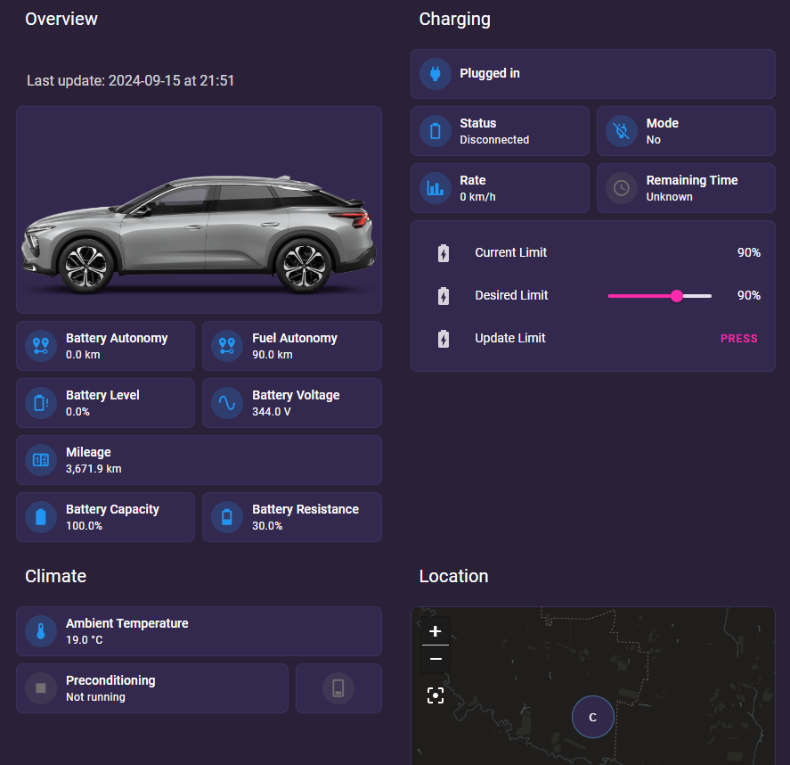

# Citroen C5X Integration

## About
This integration is based on the work of [@Flodu31](https://github.com/Flodu31/HomeAssistant-PeugeotIntegration/blob/main/Citroen-ec4.md) with a few additions, namely:

- autonomy sensor for fuel
- extra sensors for battery health
- coordinates extraction and implementation of the device tracker

## Pre-requisites
- [PSA Car Controller](https://github.com/flobz/psa_car_controller), refer to one of the below installation methods:
    - Setup with [Docker](https://github.com/flobz/psa_car_controller/blob/master/docs/Docker.md)
    - Setup with [Kubernets](https://github.com/maxim-mityutko/home-infra/tree/feature-psa/kubernetes/cluster/smart-home/psa-car-controller)
    - Setup with [HASS Addon](https://github.com/flobz/psacc-ha)
- [Home Assistant](https://home-assistant.io)

**PSA Car Controller** exposes the API on port 5000 (by default) that can be used to collect metadata about the car, as well as controll charging limits, preconditioning and a few other aspects of car management.

The **REST** integration of *Home Assistant* is used to interract with the controller.

## Configuration

### Sensors
Copy the configuration from  [/config/sensors/citroen-c5x.yaml](../../config/sensors/citroen-c5x.yaml)

Below templates will be created in HASS:
- All Metadata
    - citroen_c5x
- Odometer
    - c5x_mileage
    - c5x_mileage_update_at
- Battery
    - c5x_battery_voltage
    - c5x_battery_current
    - c5x_battery_level
    - c5x_battery_autonomy
    - c5x_battery_health_capacity
    - c5x_battery_health_resistance
    - c5x_charging_status
    - c5x_charging_remaining_time
    - c5x_charging_plugged
    - c5x_charging_mode (will be deprecated)
    - c5x_charging_rate
    - c5x_charging_status_updated_at
- Fuel
    - c5x_fuel_autonomy
- Environment
    - c5x_ambient_temperature
- Preconditioning
    - c5x_preconditioning_status
- Position
    - c5x_latitude
    - c5x_longitude

### Automations
Copy the configuration from  [/config/automations/citroen-c5x.yaml](../../config/automations/citroen-c5x.yaml)

- citroen_c5x_position - Creates new device tracker: `c5x_position`

## Dashboard
Copy the configuration from  [/config/dashboards/citroen-c5x.yaml](../../config/automations/citroen-c5x.yaml), note that the dashboard uses `sections` view type, uses [Mushroom Cards](https://github.com/piitaya/lovelace-mushroom) and the car image is uploaded to `/config/www` to be served locally.
