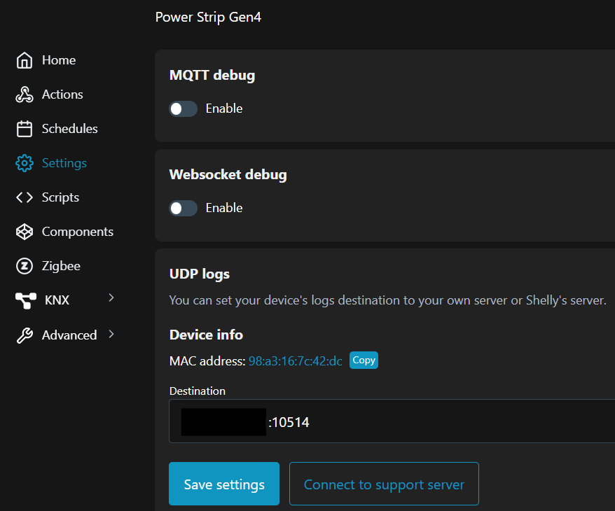

# Shelly Power Strip 4 Gen4

## Update Frequency
The device sends too much updates for certain metrics via Zigbee protocol which floods the MQTT server with unnecessary messages.

- Configured new reporting criteria for `acFrequency` and `apparentPower` for each endpoint (see screenshot). This reduced the frequency of updates that are broadcasted via Zigbee protocol.
    

- Configured `debounce` parameter in device settings to 5 seconds, while simultaneously configuring `debounce_ignore` for `power_x` and `state_x` properties.
    

**UPDATE 2026-02-27**

Altered the reporting frequency for `currentSummReceived` in the `seMetering` cluster.
    
Message frequency improved significantly, though it is still high compared to other devices.
    


If you end up here, take a look at [this thread](https://community.shelly.cloud/topic/11528-zigbee-network-instability-flooding-with-two%C2%A0shelly-power-strip-4-gen4%C2%A0zigbee2mqtt-cc2652p7/#findComment-50654) on Shelly's forum as well.

## UI Availability

The UI of the device becomes occasionally not available and power strip stops responding to ping. At the same time the Zigbee integration via Zigbee2MQTT and native Home Assistant integration via WebSocket operates without delays or issues. After some time UI and ping starts to work again. If the device is constantly pinged then connectivity to the UI is never lost.

**UPDATE 2025-11-20:** Looks like the connectivity issues only appear with Zigbee firmware. The device is very stable, if Matter firmware is used.

**UPDATE 2025-11-30:** Ordered another power strip, firmware versions are exactly the same. So far the UI was accessible without any issues for 24 hours. At the same time the device is also connected to the Zigbee network.

### Debugging

*Collecting logs as per request of the Shelly support team. Logs are shipped via UDP to the `rsyslog` server running in Ubuntu.*

#### Log Collector

1. `sudo mkdir -p /var/log/shelly`
1. `sudo chown syslog:adm /var/log/shelly`
1. `sudo nano /etc/rsyslog.d/10-udp-logging.conf`

    ```c
    module(load="imudp")
    input(type="imudp" port="10514")

    template(name="ShellyLogFormat" type="string" string="%msg%\n")

    if $inputname == "imudp" then {
        action(type="omfile" fileOwner="syslog" fileGroup="adm"
            fileCreateMode="0644" dirCreateMode="0755"
            file="/var/log/shelly/udp.log"
            template="ShellyLogFormat")
        stop
    }
    ```

1. `sudo systemctl restart rsyslog`
1. Check if server is listening on required port: `sudo ss -uln | grep 10514`

#### Log Rotation

1. `sudo nano /etc/logrotate.d/shelly-udp`

    ```yaml
    /var/log/shelly/udp.log {
        size 50M
        rotate 50
        compress
        missingok
        notifempty
        copytruncate
    }
    ```

1. Test rotation: `sudo logrotate --force /etc/logrotate.d/shelly-udp`

#### Configure Shelly

Go to: `Settings` -> `Debug` -> `UDP logs`


